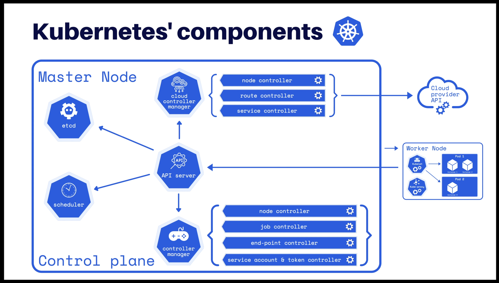

# Hùng's Docker / Swarm / Kubernetes learning notes

## Quickest way to install Docker
-   `curl -sSL https://get.docker.com/ | sh`: Docker's automated script to add their repository and install all dependencies

## Concepts
-   Port conflict errors occur when multiple services are running on the same published port on the same host, not in multiple containers. Each container gets its own internal IP behind NAT, so the ports won't conflict across two container network interfaces.

## Very basics
-   `docker container run $CONTAINER_NAME` - start a new container
-   `docker container ls -a` - list all containers (running and stopped)
-   `docker image ls` - list all images
-   `docker container run -p $HOST:$CONTAINER` - port forwarding (`-p` is short for `--publish`)

## Getting a Shell Inside Containers
-   `docker container run -it` - start new container interactively
-   `docker container exec -it` - run additional commend in existing container
-   By using the `docker exec -it <container> sh` (or bash) command on a container, we can connect to a shell from inside it.

## Container networking
## Concepts
-   Create your apps so frontend/backend sit on same Docker network.
-   Their inter-communication never leaves host
-   All externally exposed prots closed by default

### DNS
-   Containers shouldn't rely on IPs for inter-communication.
-   DNS for friendly names is built-in if you use custom networks.

## Commands
-   `docker network ls` Show networks
-   `docker network inspect` Inspect a network
-   `docker network create --driver` Create a network
-   `docker network connect` Attach a network to container
-   `docker network disconnect` Detach a network from container

## Docker *Image*
## Concepts
-   Images are made of file system changes and metadata
-   Each layer is uniquely identified and only stored once on a host
-   This saves storage space on host and transfer time on push/pull
-   A container is just single read/write layer on top of image
-   **tagging** is important, it identifies a specific commit/"version" of an image

## Dockerfile
### Stanzas
-   The main purpose of a `CMD` is to provide defaults for an executing container.
The CMD instruction has three forms:

    -   `CMD ["executable","param1","param2"]` (exec form, this is the preferred form)
    -   `CMD ["param1","param2"]` (as default parameters to ENTRYPOINT)
    -   `CMD command param1 param2` (shell form)

### Building
-   Keeping the parts that change the least **AT THE TOP** of the Dockerfile, the parts that change the most **AT THE BOTTOM** of the Dockerfile.

## Persistent data
-   Docker has 2 main methods to persist data: **volumes** and **bind mounts**.
-   **Volume**: e.g. `docker container run -d --name mysql MYSQL_ALLOW_EMPTY_PASSWORD=True -v mysql-db:/var/lib/mysql mysql`. Whereby `mysql-db` is the named volume.
-   **Bind mounting**: 
    -   This maps a host file or directory to a container file or directory (If they both exists, the host wins).
    -   Can't use in `Dockerfile`, must be at `container run ...`
    -   E.g. `container run ... -v /user/hung/stuff:/path/container`
    -   Changes are updated **live!**. If a file is edited/added/removed from the host bind-mounted folder, the change will be reflected in the container! 

## docker-compose

-   Volumes: add `:ro` at the end of the volume path to specify "Read-only" e.g. `docker container run ... -v /local/path:/container/path:ro ...`
-   **docker-compose** will automatically create a virtual network to include all the services.
-   What you name the service under `services` will actually be the **DNS** on the Docker container private network!

## Swarm

-   `docker swarm init` to enable initialise Swarm. Swarm is not activated out of the box for Docker.
-   Key commands:
    -   `docker service create ...`
    -   `docker service update ...`
    -   `docker service ls ...`
    -   `docker service rm ...`
    -   `docker service ps <service_name>`: List the tasks of one or more services
-   Adding nodes to a swarm: 
    -   The nodes need to be able to talk to each other (ICMP, TCP and UDP connections enabled).
-   Docker Swarm networking:
    -   `docker network create --driver overlay <network_name>`: overlay network driver is used for container communication across a swarm.
    -   Containers and networks are a many-to-many relationship. A single container can be attached to many networks and vice versa.
    -   Swarm has **routing mesh**, which receives packets for a Service to distribute to proper Tasks. It spans all nodes across the Swarm and creates a virtual IP (VIP) serving as an interface for inbound traffic. This IP is also a load balancer that decides which node gets the traffic.
-   Node management:
    -   `docker node ls`: List out all the nodes.
    -   `docker swarm update ...`: Update certain characteristics of the Swarm environment.

### Stacks
-   Stacks are Production Grade Compose, accepting Compose files as their declarative definition for services, networks, and volumes.
-   `docker stack deploy ...` command

-   Version needs to be 3+

### Secrets
-   Secrets are applicable in Swarm only.
-   `docker secret create secret_name secret_file`: Creating secrets from plain text files
-   `echo "yourSecret" | docker secret create secret_name -`: Creating secrets from typing it out
-   After *removing/updating* secrets, service containers will be re-created. It is part of the immutable design.
-   Secrets and Stacks: version needs to be at least 3.1

### Full App Lifecycle With Compose
-   Single set of Compose files for:
    -   Local `docker-compose up` development environment
    -   Remote `docker-compose up` CI environment
    -   Remote `docker stack deploy` production environment
    -   `docker-compose -f a.yml -f b.yml up`: Layering Compose files:
        -   docker-compose.yml: base file
        -   docker-compose.override.yml: override file, Docker Compose will read this file automatically
        -   docker-compose.test.yml: test compose file for CI environment
        -   docker-compose.prod.yml: compose file to bring into production
        -   Examples:
            -   CI deployment: `docker-compose -f docker-compose.yml -f docker-compose.test.yml up -d`
            -   Getting production config yml: `docker-compose -f docker-compose.ynl -f docker-compose.prd.yml config > output.yml`
    -   *Remember*: `docker compose` is only for local development, not production!

### Swarm Update Examples
-   Just update the image used to a newer version: `docker service update --image myapp:1.2.1 <servicename>`
-   Adding an environment variable and remove a port: `docker service update --env-add NODE_ENV=production --publish-rm 8080`
-   Change number of replicas of two services: `docker service scale <servicename1>=8 <servicename2>=6`
-   Swarm Updates in Stack Files:
    -   Same command. Just edit the YAML file, then `docker stack deploy -c file.yml <stackname>`
-   `docker service update --force <servicename>`: Force update even if no changes require it

### Docker Healthchecks
-   Healthcheck status shows up in `docker container ls`
-   Check last 5 healthchecks with `docker container inspect`
-   Docker run does nothing with healthchecks
-   Services will replace tasks if they fail healthcheck
-   Service updates wait for them before continuing
-   Example command:
    ```shell
    docker run \
        --health-cmd="curl -f localhost:9200/_cluster/health || false" \
        --health-interval=5s \
        --health-retries=3 \
        --health-timeout=2s \
        --health-start-period=15s \
        elasticsearch:2
    ```
-   Example in Dockerfile - Nginx:
    ```Dockerfile
    FROM nginx:1.13

    HEALTHCHECK --interval=30s --timeout=2s --interval=3s --retries=3 \
        CMD curl -f http://localhost/ || exit 1
    ```
-   Example in Dockerfile - Postgres:
    ```Dockerfile
    FROM postgres

    # specify real user with -U to prevent errors in logs

    HEALTHCHECK --interval=5s --timeout=3s \
        CMD pg_isready -U postgres || exit 1
    ```

### Other notes
-   When we do a `docker stack deploy` on an existing stack, it will deploy the changes as service updates.

## Docker Registry
-   Private image registry for your network
-   At its core: a web API and storage system, written in Go.
-   Registry and Proper TLS: Docker won't talk to registry without HTTPS.

### Key commands:
-   `docker container run -d -p 5000:5000 --name registry registry`: Run the registry image.
-   Re-tag an existing image and push it to your new registry:
    -   `docker tag hello-world 127.0.0.1:5000/hello-world`
    -   `docker push 127.0.0.1:5000/hello-world`
-   Remove that image from local cache and pull it from new registry
    -   `docker image remove hello-world`
    -   `docker image remove 127.0.0.1:5000/hello-world`
    -   `docker pull 127.0.0.1:5000/hello-world`
-   Re-create registry using a bind mount and see how it stores data
    -   `docker container run -d -p 5000:5000 --name registry -v $(pwd)/registry-data:/var/lib/registry registry`
-   Secure registry with TLS tutorial link: [Here](https://training.play-with-docker.com/linux-registry-part2/)

## Going into production tips
-   Focusing on Dockerfiles first! Those are your new *"build documentation"*
    -   Make it start 
    -   Make it log all things to stdout/stderr
    -   Make it documented in file
    -   Make it work for others
    -   Make it lean
    -   Make it scale
-   OS Linux Distribution/Kernel Matters. Docker is very kernel and storage driver dependent.
    -   Ubuntu is pretty safe choice
-   A better alternative for solo-VM image is 1-node Swarm, which benefits from the extra features of Swarm.
-   Don't turn cattle into pets
    -   Assume nodes will be replaced
    -   Assume containers will be recreated
    -   Docker for (AWS/Azure) does this
    -   I.e. don't make a single node "special" by installing stuff on it and doing everything from that node.
-   Things to outsource, i.e. Not using open-source --> SaaS, potentially (trading free for convenience):
    -   Image registry
    -   Logs
    -   Monitoring and alerting
-   Pure open-source self-hosted tech stack
    -   HW/OS: InfraKit / Terraform
    -   Runtime: Docker
    -   Orchestration: Docker Swarm
    -   Networking: Docker Swarm
    -   Storage: REX-Ray
    -   CI/CD: Jenkins
    -   Registry: Docker Distribution + Portus
    -   Central Logging: ELK
    -   Central Monitoring: Prometheus + Grafana
    -   Swarm GUI: Portainer
-   Docker for X: Cheap and Easy Tech Stack
    -   HW/OS: Docker for AWS/Azure
    -   Runtime: Docker
    -   Orchestration: Docker Swarm
    -   Networking: Docker Swarm
    -   Storage: Docker for AWS/Azure
    -   CI/CD: Codeship / TravisCI / Gitlab / CircleCI / Github Actions
    -   Registry: Docker Hub / Quay
    -   Layer 7 Proxy: Flow-Proxy / Traefik
    -   Central Logging: Docker for AWS/Azure
    -   Central Monitoring: Librato / Sysdig
    -   Swarm GUI: Portainer
-   Docker Enterprise Edition + Docker for X
    -   HW/OS: Docker for AWS/Azure
    -   Runtime: Docker EE
    -   Orchestration: Docker Swarm
    -   Networking: Docker Swarm
    -   Storage: Docker for AWS/Azure
    -   Storage: Docker for AWS/Azure
    -   CI/CD: Codeship / TravisCI / Gitlab / CircleCI / Github Actions
    -   Layer 7 Proxy: Docker EE (UCP)
    -   Central Logging: Docker EE (DTR)
    -   Central Logging: Docker for AWS/Azure
    -   Central Monitoring: Librato / Sysdig
    -   Swarm GUI: Docker EE (UCP)


# Kubernetes
-   It is a popular container orchestrator
-   Rule of thumb to evaluate the benefit of orchestration:
    -   **It is a function of number of servers + Change rate**

### Kubernetes or Swarm?

#### Swarm
-   Swarm: **Easier** to deploy / manage
-   Kubernetes: More features and flexibility
-   Advantages of Swarm:
    -   Comes with Docker, single vendor container platform
    -   Easiest orchestrator to deploy/manage yourself
    -   Follow 80/20 rule, 20% of features for 80% of use cases
    -   Runs anyhwhere Docker does:
        -   Local, cloud, datacenter
        -   ARM, Windows, 32-bit
-   Secure by default
-   Easier to troubleshoot, fewer moving parts

#### Kubernetes
-   Clouds will deploy/manage Kubernetes for you
-   Infrastructure vendors are making their down distributions
-   Widest adoption and community
-   Flexible: Covers widest set of use cases
-   "Kubernetes first" vendor support
-   "No one ever got fired for buying IBM"
    -   Picking solutions isn't 100% rational
    -   Trendy, will benefit your career
    -   CIO/CTO Checkbox

### Kubernetes basics
-   **Number of nodes need to be odd to get consensus**
-   Kubernetes: the whole orchestration system
-   Kubectl ("cube control"): CLI to configure Kubernetes and manage apps
-   Node: single server in the Kubernetes cluster
-   Kubelet: Kubernetes agent running on nodes
-   Control Plane: set of containers that manage the cluster
    -   Includes API server, scheduler, controller manager, etcd (distributed storage system), and more
    -   Sometimes called the "master"
-   **Pod**: one or more containers running together on one Node
    -   Basic unit of deployment. Containers are always in pods.
-   **Controller**: for creating / updating pods and other objects.
-   **Service**: network endpoint to connect to a pod.
-   **Namespace**: Filtered group of objects in cluster
-   **ReplicaSet**: its purpose is to maintain a stable set of replica Pods running at any given time.
-   Secrets, ConfigMaps, and more

### Basic commands (Kubernetes 1.14 -> 1.17)
-   `kubectl run`: **changing to be only for pod creation.**
-   `kubectl create`: create some resources in via CLI or YAML.
-   `kubectl apply`: create/update anything via YAML.
-   Two ways to deploy Pods (containers): Via commands, or via YAML

### Scaling ReplicaSets examples
-   `kubectl run my-apache --image httpd`
-   `kubectl scale deploy/my-apache --replicas 2`
    -   Equivalent: `kubectl scale deployment my-apache --replicas 2`

### Inspecting Deployment Objects examples
-   `kubectl get pods`
-   `kubectl logs deployment/my-apache --follow --tail 1`
    -   `--follow` checks for anything new that will come up
    -   `--tail 1` is returning the last line
-   Lookup the **Stern** tool for better log tailing
-   `kubectl describe pod/my-apache-xxxx-yyyy`: get a bunch of details about an object, including events!
-   **Rule of thumb**: modify the higher-level object for changes to be reflected in the lower level objects E.g. modifying Deployments and ReplicaSets to influence Pods.

### Services
-   Exposing containers via `kubectl expose`: creates a service for existing pods
-   A **service** is a stable address for pod(s)
-   If we want to connect to pod(s), we need a **service**
-   CoreDNS allows us to resolve **services** by name
    -   E.g. if a service name is `mywebapp` with exposed 443 (HTTPS) and 8080 port --> `https://mywebapp:8080`

#### Basic Service Types
-   **ClusterIP**: only good **inside the cluster**
    -   Single, internal virtual IP allocated
-   **NodePort**:
    -   **Open to the outside world**
    -   High port allocated on each node
    -   Port is open on every node's IP
    -   Anyone can connect (if they can reach node)
    -   Other pods need to be updated to this port
    -   Example: `kubectl expose deployment/httpenv --port 8888 --name httpenv-np --type NodePort`
-   **LoadBalancer**:
    -   Controls a LB endpoint external to the cluster
    -   Only relevant to inbound traffic
    -   3 layers: LoadBalancer takes the packet and passes it to NodePort. NodePort then passes it to ClusterIP.
    -   Example: `kubectl expose deployment/httpenv --port 8888 --name httpenv-lb --type LoadBalancer`
-   **ExternalName**:
    -   Is about allowing cluster talking to external services 
-   `kubectl get service`: look up what IP was allocated
-   Services also have a fully qualified domain name (FQDN)
    -   `curl <hostname>.<namespace>.svc.cluster.local`

### Kubernetes Management Techniques
-   `kubectl run` is and will only be for creating one-off tasks like creating a Pod.
-   `kubectl run` is not recommended for production, only for simple dev/test or troubleshooting Pods.

#### Generators   
-   These are helper templates called **generators**
-   Every resource in Kubernetes has a specification or "spec". Examples:
    -   `kubectl create deployment sample --image nginx --dry-run -o yaml`
        -   `--dry-run -o yaml` --> output template YAML
    -   `kubectl expose deployment/test --port 80 --dry-run -o yaml`

#### Management approaches
-   **Imperative commands**: `run`, `expose`, `scale`, `edit`, `create deployment`
-   **Imperative objects**: `create -f file.yml`, `replace -f file.yml`, ...
-   **Declarative objects**: `apply -f file.yml`, or `dir\`, `diff`
    -   Best for prod, easier to automate
    -   Harder to understand and predict changes
-   Most Important Rule:
    -   **Don't mix the three approaches!**
-   Move to `apply -f file.yml` and `apply -f directory\` for prod
-   Store yaml in git, git commit each change before you apply
-   This trains you for later doing GitOps (where git commits are automatically applied to clusters)

### Declarative Kubernetes YAML
-   Focus on the YAML or JSON file
-   Create/update resources in a file: `kubectl apply -f filename.yml`
-   Create/update a whole directory of yaml: `kubectl apply -f myyaml\`
-   Create/update from a URL: `kubectl apply -f https://bret.run/pod.yml`
    -   Be careful! Look at the file first!
-   Each file contains one or more manifests
-   Each manifest describes an API object (deployment, job, secret)
-   Each manifest needs four parts (root key:values in the file)
    -   `-   apiVersion:`
    -   `-   kind:`
    -   `-   metadata:`
    -   `-   spec:`
-   `kind`: getting a list of resources the cluster supports
    -   `kubectl api-resources`
-   `apiVersion`:
    -   `kubectl api-versions`
    -   Old api version with new cluster can result in some issues with deploying
-   `metadata`: only name is required
-   `spec`: the **most important** manifest, where all the action is at!

#### Building the YAML spec
-   `kubectl explain services --recursive`: getting all the keys each kind support
-   Drilldown example:
    -   `kubectl explain services.spec`
    -   `kubectl explain services.spec.type`
    -   `kubectl explain deployment.spec.template.spec.volumes.nfs.server`
-   We can also suse docs --> Kubernetes API reference
-   `kubectl diff -f app-yml`: visually showing the difference between the specs from latest (changed) YAML file and current specs on disk!
-   `labels` goes under `metadata` in the YAML
    -   Simple list of key: value for identifying your resource later by selecting, grouping, or filtering for it.
    -   Common examples include:
        -   tier: frontend
        -   app: api
        -   env: prod
        -   customer: jpmc
    -   Not meant to hold complex, large, or non-identifying info, which is what **annotations** are for
    -   Filter a `get` command: `kubectl get pods -l app=nginx`
    -   Apply only matching labels
        -   `kubectl apply -f myfile.yaml -l app=nginx`
    -   Label Selectors:
        -   It is the **"glue"** telling Services and Deployments which pods are theirs
            ```YAML
            selector:
            app: app-nginx
            ```
        -   Use Labels and Selectors to control which pods to go to which nodes.

### Storage in Kubernetes
-   **StatefulSets** is a new resource type, making Pods more sticky.
-   Recommendation: avoid stateful workloads for first few deployments until you're good at the basics
    -   Use db-as-a-service whenever you can.
-   Volumes:
    -   Tied to lifecycle of a Pod
    -   All containers in a single Pod can share them
-   PersistentVolumes:
    -   Created at the cluster level, outlives a Pod
    -   Separates storage config from Pod using it
    -   Multiple Pods can share them
-   CSI (Container Storage Inferface) plugins are the new way to connect to storage.

### Ingress
-   Definition: it is an API object that manages external access to the services in a cluster, typically HTTP.
    -   Ingress may provide load balancing, SSL termination and name-based virtual hosting.
-   How do we route outside connections based on hostname or URL?
-   Ingress Controllers (optional) do this with 3rd party proxies
-   Nginx is popular, but Traefik (Bret's favourite), HAProxy, F5, Envoy, Istio, etc.

### CRD's and The Operator Pattern
-   You can add 3rd party Resources and Controllers
-   This extends Kubernetes API and CLI
-   Pattern:
    -   Operator: automate deployment and management of complex apps
        -   E.g. databases, monitoring tools, backups, and custom ingresses.
        -   These are in essence very complex YAML.

### Higher Deployment Abstractions
-   All our `kubectl` commands just talk to the Kubernetes API
-   Kubernetes has limited built-in templating, versioning, tracking, and management of your apps 
-   **Helm** is the most popular
-   **Compose on Kubernetes** comes with Docker Desktop --> `stack deploy` can deploy Kubernetes instead of Swarm.
    -   It is a lot simpler by using the Compose YAML, but it doesn't support everything that Kubernetes does. But again, use 80/20 rule.
-   Most distros support **Helm**

### Kubernetes Dashboard
-   Default GUI for "upstream" Kubernetes: `github.com/kubernetes/dashboard`
-   Other 3rd party options: (Rancher, Docker Ent, OpenShift)
-   Safety first!
    -   Put a proxy in front of it for authentication.

### Kubectl Namespaces and Context
-   Namespaces limit scope, aka "virtual clusters"
-   Not related to Docker/Linux namespaces
-   Won't need them in small clusters
-   Example commands:
    -   `kubectl get namespaces`
    -   `kubectl get all --all-namespaces`
-   See `~/kube/.config`
    -   `kubectl config get-contexts`

# Kubernetes notes
## Kubernetes architecture
-   Master and worder Nodes
-   Master
    -   etcd: the database for the cluster (A distributed, reliable key-value store for the most critical data of a distributed system)
    -   Controller Manager
    -   Scheduler
    -   API Server: heart and soul of the cluster
-   A Node
    -   Physical infrastructure
    -   OS
    -   Container Runtime e.g. Docker, containerd, CRI-O, etc.
    -   Containers
    -   Kubelet: Kubernetes cluster's agent on the node, running the containers. Taking orders and talking back and forth with the API.
    -   Kube-proxy: receives orders from the node agent and implementing network settings on the local machine.
-   Overlay Network (Flannel/OpenVSwitch/Weave): connecting all Nodes and the Master
-   Control Plane (consisting of one or more Master(s))
-   CoreDNS
-   

## Kubernetes architecture - the nodes
-   Runs a collection of services:
    -   A container Engine (e.g. Docker)
    -   Kubelet (the node agent)
    -   kube-proxy (a necessary but not sufficient network component)

## Ther control plane:
-   Runs a collection of services:
    -   The API server (our entrypoint to everything!)
    -   Core services like the scheduler and controller manager
    -   `etcd` (a highly available key/value store; the "database" of Kubernetes)

## Pod
-   A **Pod** is an abstraction of one or more containers --> The **lowest deployable** unit in Kubernetes. We don't touch containers directly in the Kubernetes context.
    -   IP addresses are associated with pods, not with individual containers
    -   Containers in a pod share `localhost`, and can share volumes (containers in the same pod can communicate via localhost)

## kubectl basics
-   `~/.kube/config` or `--kubeconfig` flag to pass a config file
-   Useful to get nodes report: `kubectl get nodes -o json | JQ ".items[] | {name:.metadata.name} + .status.capacity"`
-   `kubectl describe node <node>`
-   `kubectl explain type`
-   Kubectl has different resource types
-   What is a Namespace? `kubectl get namespaces`
    -   Namespace allow us to segregate resources
    -   See all pods in all namespaces `kubectl get pods --all-namespaces` or `kubectl get pods -A`
    -   `kubectl get pods --namespace=kube-system` or `kubectl get pods -n kube-system`
    -   We can use `-A`/`--all-namespaces` with most commands that manipulate multiple objects e.g.
        -   `kubectl delete` can delete resources across multiple namespaces
        -   `kubectl label` can add/remove/update labels across multiple namespaces
    -   `kube-public` namespace is created by our installer & used for security bootstrapping. The only interesting object in `kube-public` is a ConfigMap named `cluster-info`
-   Deployment (resource) -> ReplicaSet (resource) -> Pod (resource) -> Container
-   A **deployment** is a high-level construct
    -   Allows scaling, rolling updates, rollbacks
    -   Multiple deployments can be used together to implement a **canary deployment**
    -   Delegates pods mangement to <i>replica sets</i>
-   A **replica** set is a low-level construct
    -   Makes sure a given number of identical pods are running
    -   Allows scaling
    -   Rarely used directly
-   Create a single pod with a custom command `kubectl run pingpong --image alpine --command -- ping 1.1.1.1`
-   Create a deployment with custom command `kubectl create deployment pingpong --image alpine -- ping 1.1.1.1`
-   `kubectl logs` can only follow 1 pod at a time
-   `kubectl delete pod` terminates the pod gracefully (Sending it the TERM signal and waiting for it to shutdown)
-   As soon as the pod is in "Terminating" state, the Replica Set replaces it
-   But we can still see the output of the "Terminating" pod in `kubectl logs`
-   Until 30s later, when the grace period expires
-   The pod is then killed, and `kubectl logs` exits
-   Scheduling cron jobs `kubectl create cronjob`
    -   `kubectl create cronjob sleep --schedule="*/3 * * * *" --restart=OnFailure --image=alpine -- sleep 10`
-   `kubectl scale deployment pingpong --replicas=8`
-   `kubectl logs -l app=pingpong --tail 1 -f` --> We cannot follow too many concurrent pods
    -   For each pod, the API server opens one extra connection to the corresponding kubelet.
-   `stern` (`brew install stern`) is a good way to follow logs on Kubernetes logs.
    -   **Important**: It could be dangerous to run a command like `stern .` since it could overload the API server if many pods are running.
        -   `stern .` will stream the logs of all the pods in the current namespace, opening one connection for each container. If thousands of containers are running, this can put some stress on the API server!